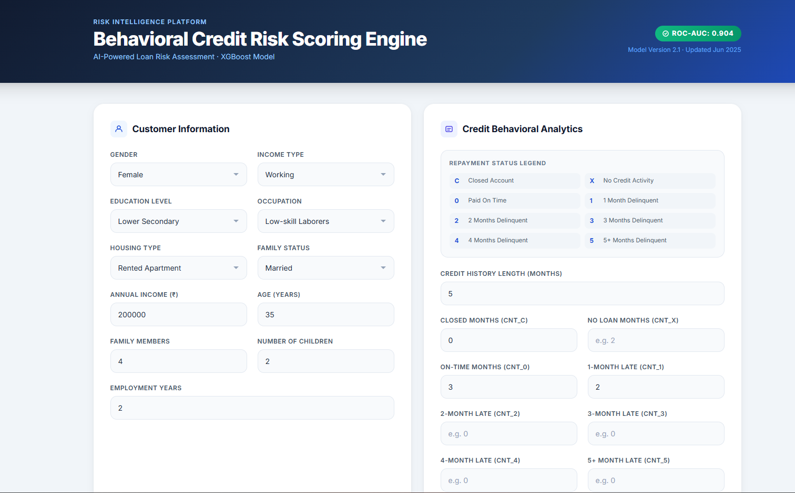
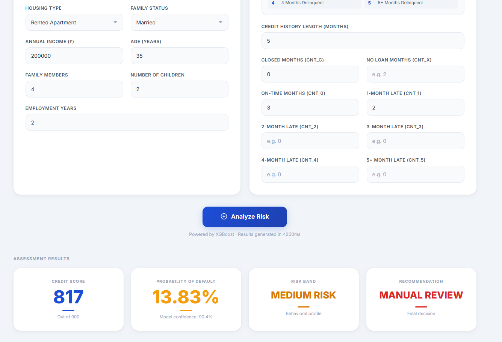
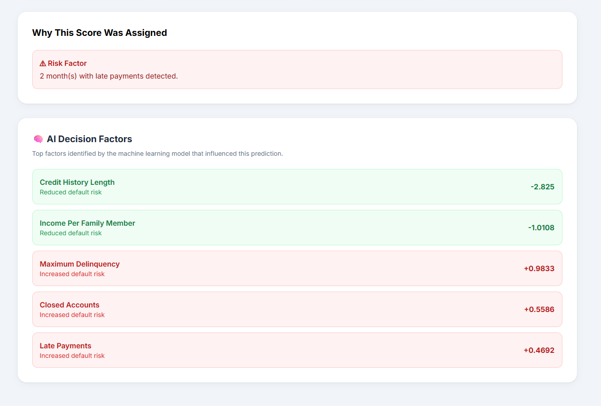
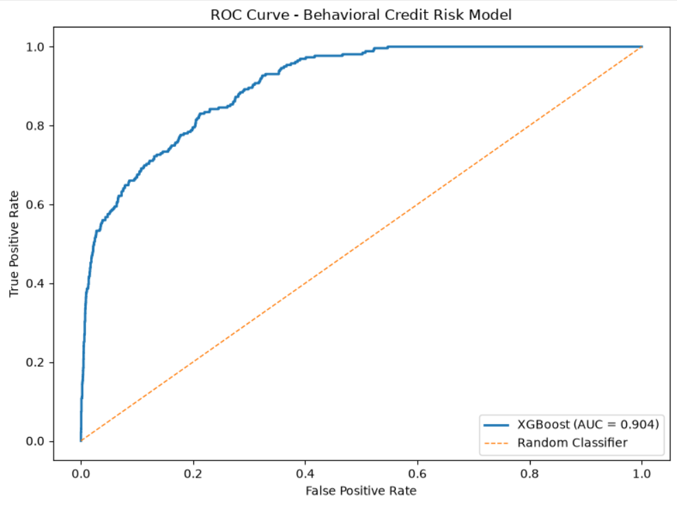

# 🏦 Behavioral Credit Risk Scoring Engine

<div align="center">

### AI-Powered Credit Risk Assessment & Explainable Decision Intelligence Platform

Predict customer default risk, generate credit scores, classify risk levels, and explain every decision using Machine Learning and Explainable AI.


</div>

---

## 📌 Overview

Traditional credit scoring systems often behave like black boxes. This project combines **Machine Learning** and **Explainable AI (XAI)** to build a transparent credit risk assessment platform.

The system evaluates a customer's financial and repayment behavior, predicts the **Probability of Default (PD)**, generates a **Credit Score (300–900)**, assigns a **Risk Category**, and explains the decision using **SHAP-based model interpretability**.

---
## 📸 Application Screenshots

### 🏠 Dashboard Home

Shows the customer information form, credit behavioral analytics section, and risk assessment workflow.



---

### 📊 Risk Assessment Results

Displays the generated Credit Score, Probability of Default (PD), Risk Band, and Recommendation.



---

### 🧠 Explainable AI

Shows both:

* Human-readable explanations
* SHAP AI Decision Factors



---

### 📈 Model Performance

ROC Curve of the XGBoost Credit Risk Model.



---
## ✨ Key Features

### 🎯 Credit Risk Prediction

* Probability of Default (PD) Prediction
* Credit Score Generation (300–900)
* Risk Classification
* Automated Loan Recommendation

### 🧠 Explainable AI

* SHAP-based feature contribution analysis
* Human-readable explanations
* Top AI Decision Factors
* Transparent risk assessment

### 📊 Interactive Dashboard

* Banking-style UI
* Responsive Design
* Real-time Predictions
* Risk Visualization

### ⚙️ Feature Engineering

* Behavioral Credit Analytics
* Delinquency Pattern Detection
* Income-Based Features
* Historical Credit Analysis

---

# 🏗️ System Architecture

```text
                        ┌────────────────────┐
                        │    User Inputs     │
                        └─────────┬──────────┘
                                  │
                                  ▼
                  ┌─────────────────────────────┐
                  │ Customer Information Layer  │
                  │                             │
                  │ • Gender                    │
                  │ • Income                    │
                  │ • Education                 │
                  │ • Occupation                │
                  │ • Housing Type              │
                  └─────────────┬───────────────┘
                                │
                                ▼
               ┌──────────────────────────────────┐
               │ Credit Behavioral Analytics Layer│
               │                                  │
               │ • CNT_C                          │
               │ • CNT_X                          │
               │ • CNT_0                          │
               │ • CNT_1                          │
               │ • CNT_2                          │
               │ • CNT_3                          │
               │ • CNT_4                          │
               │ • CNT_5                          │
               └──────────────┬───────────────────┘
                              │
                              ▼
                 ┌─────────────────────────┐
                 │ Feature Engineering     │
                 │                         │
                 │ • History Length        │
                 │ • Income Per Person     │
                 │ • Log Income            │
                 │ • Max Status Past       │
                 │ • Has Children          │
                 │ • Has Ever Been Late    │
                 └─────────────┬───────────┘
                               │
                               ▼
                 ┌─────────────────────────┐
                 │ XGBoost Classifier      │
                 │                         │
                 │ Probability Prediction  │
                 └─────────────┬───────────┘
                               │
               ┌───────────────┼───────────────┐
               ▼                               ▼
    ┌─────────────────┐            ┌─────────────────┐
    │ Credit Score    │            │ Risk Category   │
    │ 300 - 900       │            │ Low / High /    │
    │                 │            │ Very High Risk  │
    └────────┬────────┘            └────────┬────────┘
             │                              │
             └──────────────┬───────────────┘
                            ▼
               ┌─────────────────────────┐
               │ Explainable AI Layer    │
               │                         │
               │ • SHAP Values           │
               │ • Top Risk Drivers      │
               │ • Human Explanations    │
               └─────────────┬───────────┘
                             │
                             ▼
               ┌─────────────────────────┐
               │ Final Decision Engine   │
               │                         │
               │ Approve                 │
               │ Manual Review           │
               │ Reject                  │
               └─────────────────────────┘
```

---

# 📂 Dataset

The project uses two datasets:

## Application Record

Customer demographic and financial information:

* Gender
* Income Type
* Occupation
* Education
* Family Status
* Housing Type
* Income
* Family Members
* Employment Information

## Credit Record

Historical repayment behavior:

| Status | Meaning            |
| ------ | ------------------ |
| C      | Closed Account     |
| X      | No Credit Activity |
| 0      | Paid On Time       |
| 1      | 1 Month Late       |
| 2      | 2 Months Late      |
| 3      | 3 Months Late      |
| 4      | 4 Months Late      |
| 5      | 5+ Months Late     |

---

# 🧪 Feature Engineering

Generated behavioral features:

```text
HISTORY_LENGTH
CNT_C
CNT_X
CNT_0
CNT_1
CNT_2
CNT_3
CNT_4
CNT_5

MAX_STATUS_PAST
HAS_EVER_BEEN_LATE

AGE
EMPLOYMENT_YEARS

INCOME_PER_PERSON
LOG_INCOME

HAS_CHILDREN
IS_PENSIONER
```

---

# 🤖 Machine Learning Pipeline

```text
Raw Data
   │
   ▼
Data Cleaning
   │
   ▼
Feature Engineering
   │
   ▼
Target Generation
   │
   ▼
Train-Test Split
   │
   ▼
XGBoost Training
   │
   ▼
Probability of Default
   │
   ▼
Credit Score Generation
   │
   ▼
Risk Classification
   │
   ▼
Explainable AI
```

---

# 🧠 Explainable AI (XAI)

The system provides two levels of explainability:

### Human Explanations

Examples:

✅ Long Credit History

✅ Stable Employment

✅ Strong Repayment History

⚠ Previous Delinquencies

⚠ Low Income Per Family Member

---

### SHAP Explanations

Top AI Decision Factors:

* Late Payments
* Maximum Delinquency
* Income Level
* Credit History Length
* Closed Accounts

Each factor shows:

* Increased Default Risk
* Reduced Default Risk

---

# 💻 Technology Stack

### Backend

* Django
* Python

### Frontend

* HTML5
* Tailwind CSS
* JavaScript

### Machine Learning

* XGBoost
* Scikit-Learn

### Explainability

* SHAP

### Data Processing

* Pandas
* NumPy

### Model Persistence

* Joblib

---

# 📁 Project Structure

```text
Behavioral-Credit-Risk-Scoring-Engine (Structure inside Django Credit risk project file)

│
├── backend
│   │
│   ├── ml
│   │   ├── credit_risk_model.pkl
│   │   └── feature_columns.pkl
│   │
│   ├── forms.py
│   ├── views.py
│   ├── urls.py
│
├── templates
│   └── index.html
│
├── requirements.txt
├── manage.py
└── README.md
```

---

# 🚀 Installation

Clone Repository

```bash
git clone <your-repository-url>
cd Behavioral-Credit-Risk-Scoring-Engine
```

Install Dependencies

```bash
pip install -r requirements.txt
```

Run Server

```bash
python manage.py runserver
```

Open:

```text
http://127.0.0.1:8000
```

---

# 📈 Outputs

The system generates:

### Credit Score

Range: **300 – 900**

### Probability of Default

Default likelihood prediction

### Risk Band

* Low Risk
* Medium Risk
* High Risk
* Very High Risk

### Recommendation

* Approve
* Manual Review
* Reject

---

# 🔮 Future Enhancements

* PDF Credit Reports
* Prediction History Tracking
* PostgreSQL Integration
* REST API
* User Authentication
* Cloud Deployment
* Automated Retraining Pipeline
* Real-Time Monitoring

---

# 👨‍💻 Author

**Dhruv Dwivedi**


---

## ⭐ If you found this project interesting, consider giving it a star.
